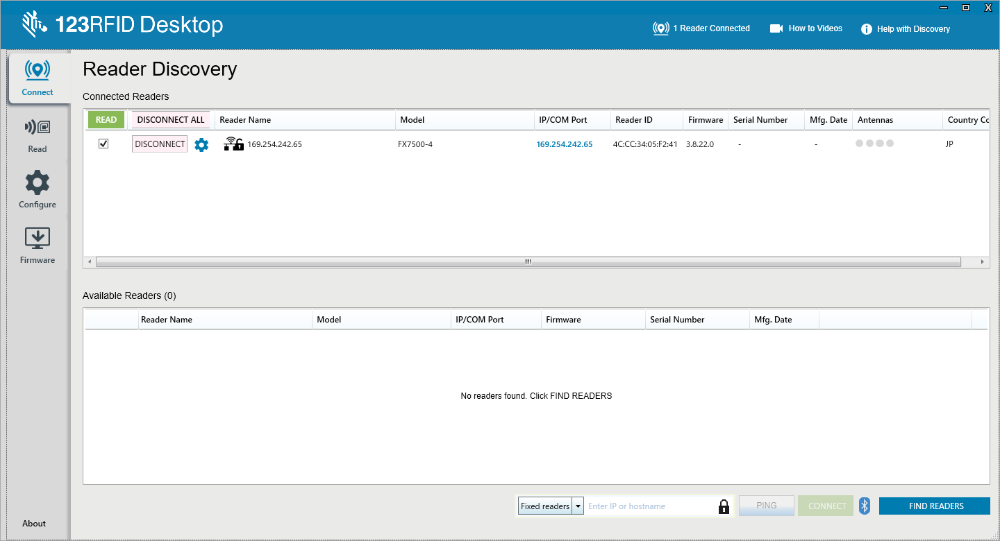
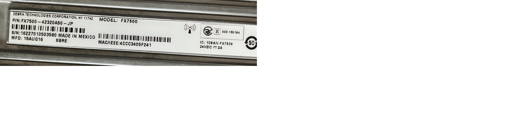
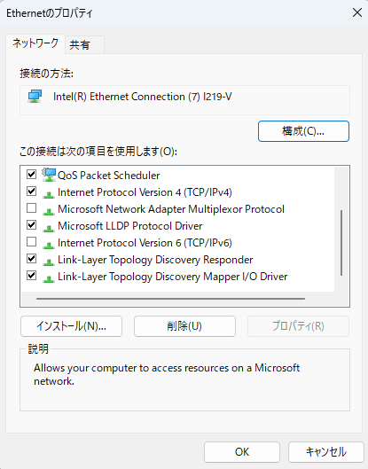
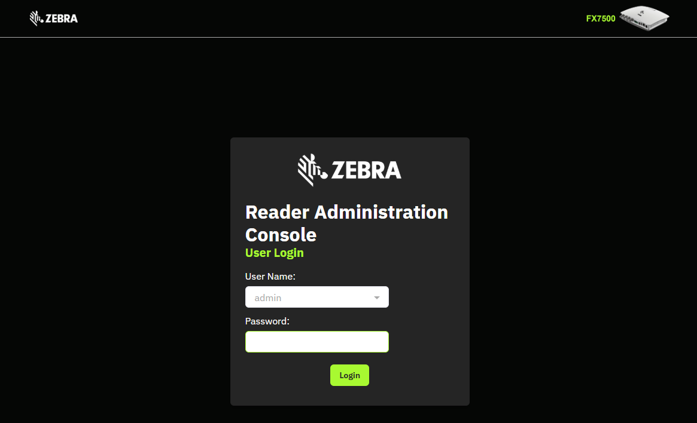
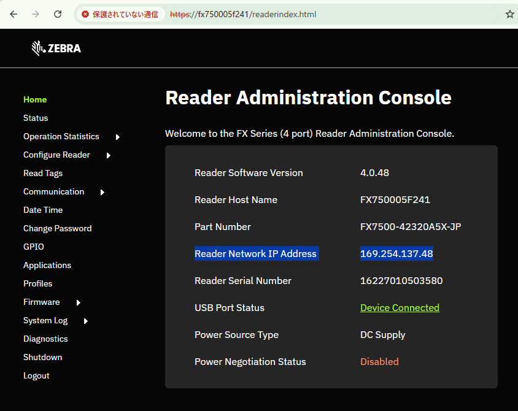
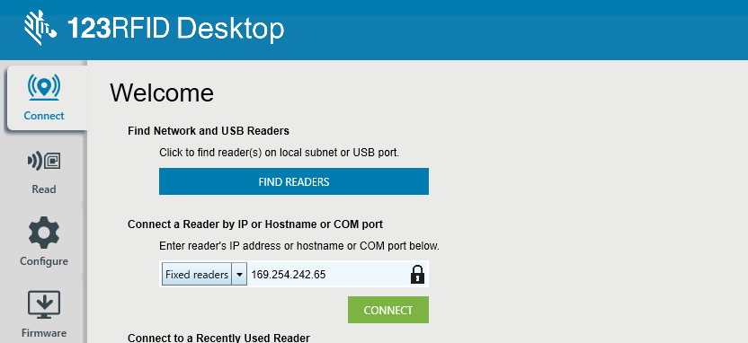
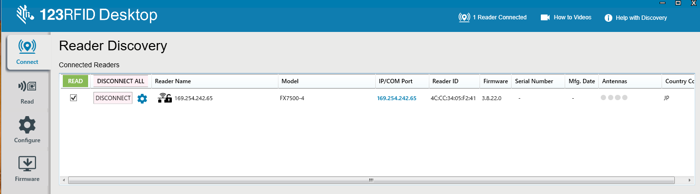

#### Zebra-FX_Connect_FX75 and FX96 to 123RFID Desktop
## FX7500とFX9600を123RFID Desktopに認識させる方法

UPDATE: 2026/09/02

<br/>



本頁ではZebra設置式リーダであるFX7500/FX9600を"123RFID Desktop"に接続する方法をご説明します。FXシリーズは色々なI/Fでデータ通信ができますが、最も一般的なEthernetを用いた方法をご説明します。

<br/>

### 必要なマテリアル

1. Windows 10以上のPC （本頁ではWin11を前提に説明）
2. ZEBRA FX7500 / FX9600 本体 (いずれか)
3. FX用のアンテナとアンテナケーブル
4. FX向け電源： ACアダプタ / POE(+)給電機 (いずれか)
5. FXとPCを接続するためのEthernetケーブルとハブ
<br/>

### FX側の設定

1. FX を工場出荷状態にする。
    - [FXシリーズ固定RFIDリーダーの工場出荷時設定へのリセット](https://support.zebra.com/ja/article/Factory-Reset-FX-Series-Fixed-RFID-Reader)

2. FXとPCをEthernetケーブル経由で接続する。
    ```
    接続例： FX7500 -- Ethernet HUB -- Win PC
    ```

1. FX の電源をON。

3. (**重要**)　FXのMACアドレスを確認し、メモしておく。
    - 本体底面ラベルにて確認可能。
    - 下記の場合、MAC アドレスは「**4CCC3405F241**」
    


### Windows PC側の設定

1. 123RFID Desktopをダウンロードしてインストールする。
   [123RFID デスクトップ (Windows 10 および Windows 11)](https://www.zebra.com/jp/ja/support-downloads/software/rfid-software/123rfid.html?downloadId=379983fe-e9e4-4e22-acd3-2b840f556970)
    <br/>

2. Ethernetネットワークアダプタを「DHCP/IPv4のみ」に設定する。
   - 設定 > ネットワークとインターネット > ネットワークの詳細設定 > その他アダプターオプション(編集)
     - IPv6の無効化
     - IPv4をDHCP設定にする
     - 
    <br/>

3. （**重要**）FXの接続ホスト名の取得
    FXの初期ホスト名は下記の命名規則となる。
    ```
    [初期ホスト名/12桁] = [ヘッダ/6桁] + [フッター/6桁]
    ```
    <br/>


    **例**、FX7500でMACが"4CCC3405F241"の場合、初期ホスト名は"**FX750005F241**"

    |項目| 参照| 例|
    |-|-|-|
    |ヘッダ/6桁| 機種名     | FX7500 |
    |フッター/6桁 | MACアドレスの下6桁 | "05F241" |

    <br/>


1. ブラウザにて、"**https://[ホスト名]**"にアクセスする
    ```
    例、https://fx750005f241
    ```
    
    <br/>


1. ログインする。
   ```
   Username: admin
   Password: change (初期パスワード)
   ```
    
    ※ 初期パスワードでログインした後はパスワード変更の依頼処理が実行されます。

    <br/>


1. (重要) IPアドレスを確認する。
    下記の場合は「**169.254.137.48**」

    
    <br/>


    - 備考：pingを用いてIPを取得することも可能。
    ```
    C:\Users\moget>ping FX750005F241

    FX750005F241.local [169.254.137.48]に ping を送信しています 32 バイトのデータ:
    169.254.137.48 からの応答: バイト数 =32 時間 <1ms TTL=64
    169.254.137.48 からの応答: バイト数 =32 時間 <1ms TTL=64
    169.254.137.48 からの応答: バイト数 =32 時間 <1ms TTL=64
    169.254.137.48 からの応答: バイト数 =32 時間 <1ms TTL=64
    ```

1. 123RFID Desktopを起動する。   
    <br/>


1. Welcome画面にて、下記入力/選択をする。
    - プルダウン選択： **Fixed Readers**
    - 入力欄： **FXのIPアドレス**
    
    <br/>


1. Connectボタンを選択する。

1. 接続を確認します。
   

以上